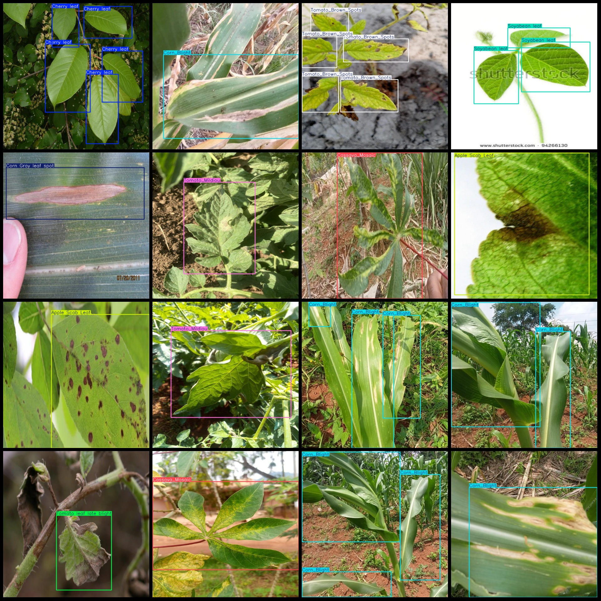
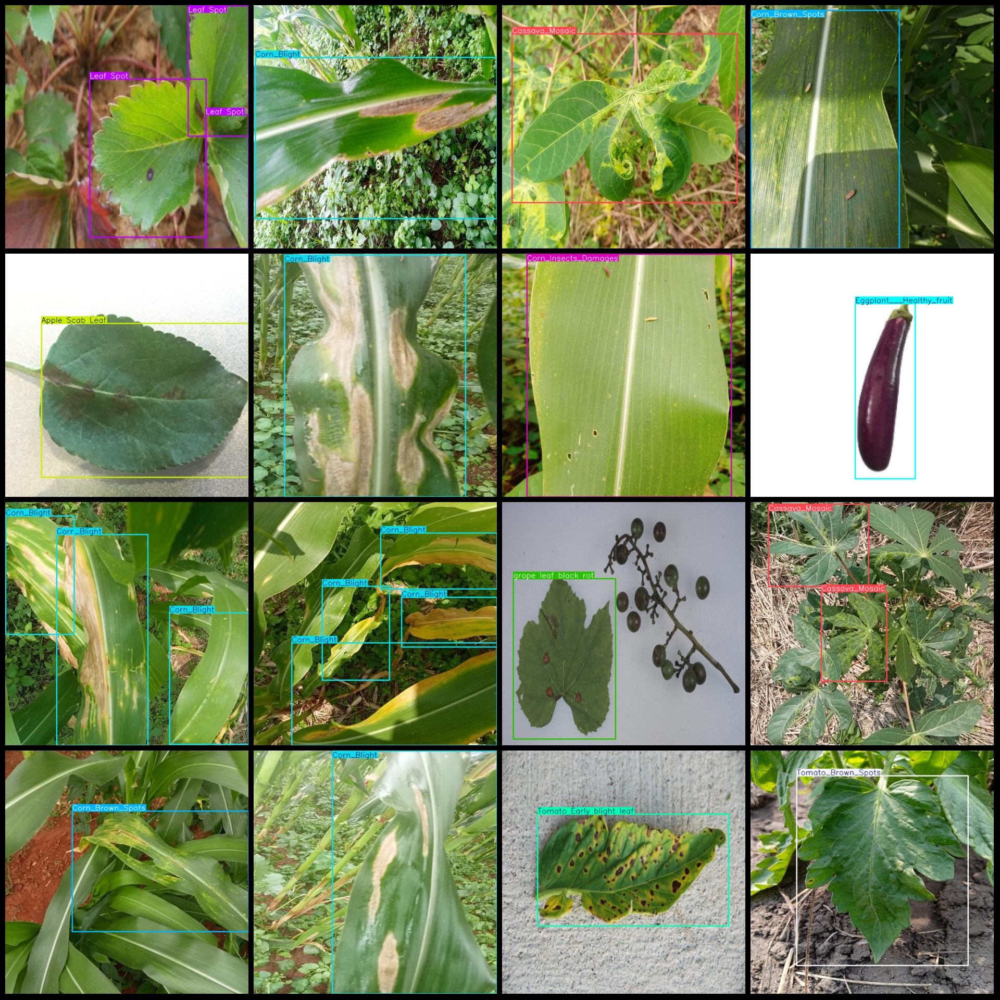

# Vegetable Disease Detection Dataset in Smart Agriculture: VOC+YOLO Format with 9845 Images and 86 Categories

According to the provided dataset format, each image will display its corresponding category names and annotation count below. For example:

- For the image of Anthrax fruit (Anthracnose fruit), the number is 4.
- For the image of Apple leaf (Apple leaf), the number is 235.

These annotation information can help researchers or developers to quickly understand the number and distribution of each category in an image.
## Images

Here is a pay link on Stripe ( https://buy.stripe.com/3cs8yP7sY87d0vu9AB ). Please contact me lonlonago@foxmail.com after funding $89, and I will send you a complete data files , thank you!

